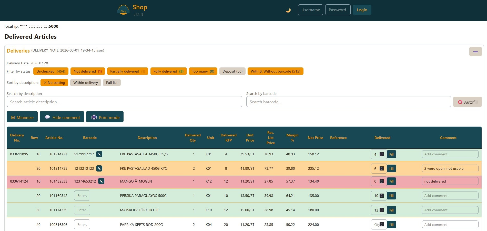
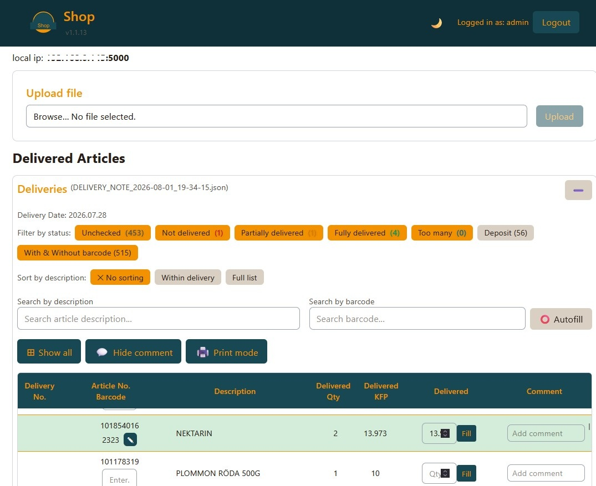
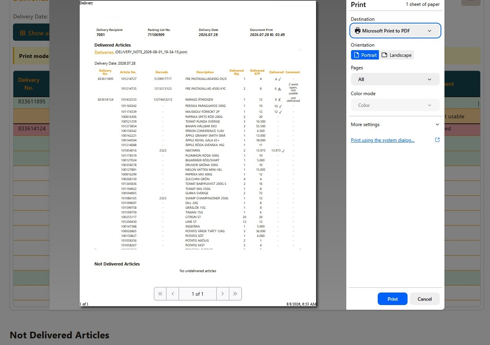

# Shop — Delivery Management System

A LAN-ready delivery-note manager: a React frontend and a Flask + Socket.IO backend, packaged together into a single executable. Flask serves both the built React app and the API from one port (`5000`), so only one server needs to be reachable on your Wi-Fi network, and only one `.exe` needs to be shipped.

- Upload a delivery note as a **PDF** (auto-parsed) or **JSON**
- Track received quantities, comments, and barcodes per article, live across every connected device via Socket.IO
- Maintains a persistent barcode ↔ article-number lookup that's reused across future deliveries

## Screenshots

|                                                   |                                                   |
| ------------------------------------------------- | ------------------------------------------------- |
|  |  |
|  |                                                   |

## Tech stack

- **Frontend:** React (built as static assets, served by Flask)
- **Backend:** Python, Flask, Flask-SocketIO
- **Packaging:** PyInstaller (single-file Windows executable)

## One-time setup

**Backend**

```bash
cd backend
python -m venv venv
venv\Scripts\activate        # Windows
source venv/bin/activate     # Mac/Linux
pip install -r requirements.txt
```

**Frontend**

```bash
cd frontend
npm install
```

## Every time you change React code

Rebuild the static files so Flask picks up the changes:

```bash
cd frontend
npm run build
```

For active frontend development with hot reload instead, run:

```bash
cd frontend
npm run dev-server
```

## Run the app (development)

```bash
cd backend
venv\Scripts\activate        # Windows
source venv/bin/activate     # Mac/Linux
python app.py
```

- Opens your browser automatically at `http://127.0.0.1:5000`
- Prints a LAN address like `http://192.168.1.42:5000` — open that on any device connected to the same Wi-Fi to reach it from elsewhere on the network
- If nothing loads from another device, check your firewall's prompt when the server first starts (allow access on private networks)

During development, `nodemon` can auto-restart the backend on file changes using the config in `.nodemonrc.json`.

## Building a standalone executable (Windows)

The easiest path is the bundled script, which builds the frontend and then runs PyInstaller in one go:

```bash
backend\build-release.bat
```

This produces `backend/dist/app.exe`, an entry named **Shop** — `Delivery Management System` in its version info — that runs the whole app (frontend + API) standalone, with no Python install required on the target machine.

To build manually instead:

```bash
cd frontend
npm run build

cd ../backend
rmdir /s /q dist build
pyinstaller --onefile --add-data "../frontend/dist;frontend/dist" app.py
```

Or, using the pre-configured spec file (recommended — keeps hidden-import and data-file settings consistent):

```bash
./venv/Scripts/pyinstaller app.spec --clean
```

## API overview

| Endpoint                   | Method | Purpose                                        |
| -------------------------- | ------ | ---------------------------------------------- |
| `/api/upload`              | POST   | Upload a delivery note as PDF or JSON          |
| `/api/deliveries`          | GET    | Full delivery data currently loaded            |
| `/api/deliveries/filename` | GET    | Filename of the currently loaded data          |
| `/api/deliveries/metadata` | GET    | Header metadata (e.g. delivery date)           |
| `/api/deliveries/barcode`  | POST   | Save a barcode for one article                 |
| `/api/deliveries/received` | POST   | Save a received quantity for one article       |
| `/api/deliveries/comment`  | POST   | Save a comment for one article                 |
| `/api/barcodeupdate`       | POST   | Sync the barcode lookup from loaded deliveries |

Every save endpoint also emits a `delivery_updated` Socket.IO event, so all connected clients stay in sync in real time.

## Notes

- `debug=False` is set in `app.py` by default — flip it on locally if you want auto-reload and Flask's interactive error pages, but keep it off for anything beyond local testing.
- Only `.pdf` and `.json` delivery notes are accepted for upload; uploaded files are always written to disk under a new timestamped filename.
